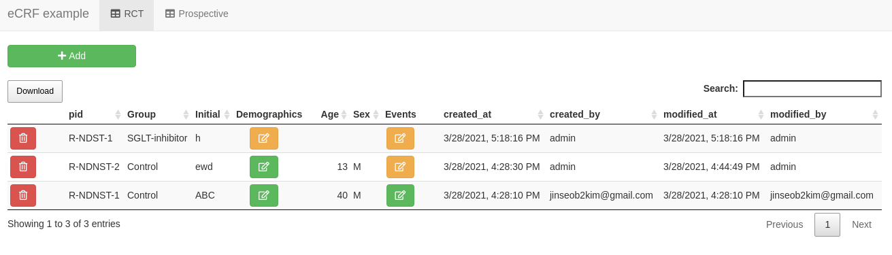
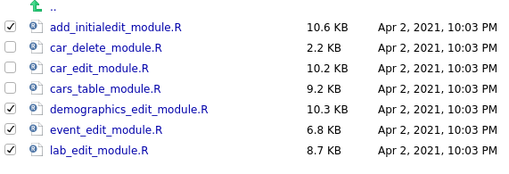

```{r setup, include=FALSE}
options(htmltools.dir.version = FALSE)
knitr::opts_chunk$set(echo = FALSE, fig.align = "center")
library(knitr);library(DT);library(shiny)
```


layout: true

<div class="my-footer"><span><a href="https://www.zarathu.com">Zarathu Co.,Ltd</a>   
&emsp;&emsp;&emsp;&emsp;&emsp;&emsp;&emsp;&emsp;&emsp;&emsp;&emsp;&emsp;&emsp;
&emsp;&emsp;&emsp;&emsp;&emsp;&emsp;&emsp;&emsp;&emsp;&emsp;&emsp;&emsp;&emsp;
<a href="https://github.com/jinseob2kim">김진섭</a></span></div> 


---

# Executive summary


.large[
삼성서울병원 [심혈관중재실 의뢰](http://www.samsunghospital.com/m/reservation/common/doctorProfile.do?DR_NO=2157): 환자데이터 입력웹(e-CRF)

- [Tychobra](https://www.tychobra.com/)의 [Shiny CRUD](https://www.tychobra.com/posts/2020-01-29-shiny-crud-traditional/) 참고해 용병 1인과 개발 중.  
]

--
.large[

- [shinymanager](https://github.com/datastorm-open/shinymanager) 로 로그인 모듈: 어떤 ID가 생성, 수정했는지 기록. 

- DB: [RSQLite](https://github.com/r-dbi/RSQLite) 이용, 파일로 관리.

- [DT](https://rstudio.github.io/DT/) 사용: proxy 기능으로 빠른 업데이트 가능. 테이블 안에 클릭(수정)버튼 삽입.

- 버튼 1개 당 [shiny module](https://shiny.rstudio.com/articles/modules.html) 1개. 

]

--
.large[
의료데이터 입력/관리/분석 통합서비스 목표. 
]

---
# 개발중



---

class: center, middle

# eCRF<br>(electronic case report form)


---
# 의학연구위해 환자정보입력 필요

.large[
- 2000년대까지는 종이설문지 후 직접 엑셀입력. 
]

<center><a href="https://www.sampleforms.com/case-report-form.html"></center>

---
# eCRF: 컴퓨터로 입력

.large[
- 입력 후 엑셀 다운로드
]

<center><a href="https://docsplayer.org/132478956-%EC%9B%B9%EA%B8%B0%EB%B0%98-%EC%9E%84%EC%83%81%EC%97%B0%EA%B5%AC%EA%B4%80%EB%A6%AC%EC%8B%9C%EC%8A%A4%ED%85%9C-%EC%86%8C%EA%B0%9C-introduction-of-icreat.html"></center>


---
# Shiny 로 데이터입력 가능?

.large[
- [Tychobra](https://www.tychobra.com/)의 [Shiny CRUD](https://www.tychobra.com/posts/2020-01-29-shiny-crud-traditional/)

https://tychobra.shinyapps.io/crud_traditional

- Add, edit, delete 버튼당 shiny module 1개.
]

<center><a href="https://www.tychobra.com/posts/2020-01-29-shiny-crud-traditional/"></center>

---
# 주요 특징 
.large[
- DB는 [RSQLite](https://github.com/r-dbi/RSQLite) 이용, 파일로 관리.

- DB query 문에 `tryCatch()` 적용, 반영 잘 되었는지 메시지 출력.

- [shinyFeedback](https://cran.r-project.org/web/packages/shinyFeedback/vignettes/shinyFeedback-intro.html) 패키지 이용.

- `DT::datatableProxy()`: 바뀐 테이블 빠르게 업데이트.

- `DT::datatable()` 안에 버튼 삽입. html로 버튼 삽입 후 **escape** 옵션으로 해당 컬럼 html 읽기.

- 입력 & 수정한 ID, 시간을 표시. 로그인은 [polished](https://polished.tech/docs/01-get-started) 이용.

]

---
# 1열에 edit/delete 버튼

```r
ids <- out$uid

actions <- purrr::map_chr(ids, function(id_) {
      paste0(
        '<div class="btn-group" style="width: 75px;" role="group" aria-label="Basic example">
          <button class="btn btn-primary btn-sm edit_btn" data-toggle="tooltip" data-placement="top" title="Edit" id = ', id_, ' style="margin: 0"><i class="fa fa-pencil-square-o"></i></button>
          <button class="btn btn-danger btn-sm delete_btn" data-toggle="tooltip" data-placement="top" title="Delete" id = ', id_, ' style="margin: 0"><i class="fa fa-trash-o"></i></button>
        </div>'
      )
    })

    # Remove the `uid` column. We don't want to show this column to the user
out <- out %>% select(-uid)

    # Set the Action Buttons row to the first column of the `mtcars` table
out <- cbind(tibble(" " = actions), out)
```

---
# js로 버튼클릭 지정 

`cars_table_module.js`


```js
function cars_table_module_js(ns_prefix) {

  $("#" + ns_prefix + "car_table").on("click", ".delete_btn", function() {
    Shiny.setInputValue(ns_prefix + "car_id_to_delete", this.id, { priority: "event"});
    $(this).tooltip('hide');
  });

  $("#" + ns_prefix + "car_table").on("click", ".edit_btn", function() {
    Shiny.setInputValue(ns_prefix + "car_id_to_edit", this.id, { priority: "event"});
    $(this).tooltip('hide');
  });
}
```

**car_id_to_delete, car_id_to_edit** 가 버튼 클릭한 행의 id 


---
# Shiny module

```r
fluidPage(
  shinyFeedback::useShinyFeedback(),
  shinyjs::useShinyjs(),
  # Application Title
  titlePanel(
    h1("Shiny CRUD Application", align = 'center'),
    windowTitle = "Shiny CRUD Application"
  ),
* cars_table_module_ui("cars_table")
)
```

```r
function(input, output, session) {

  # Use session$userData to store user data that will be needed throughout
  # the Shiny application
  session$userData$email <- 'tycho.brahe@tychobra.com'

  # Call the server function portion of the `cars_table_module.R` module file
* callModule(
*  cars_table_module,
*  "cars_table"
  )
}
```

---
# Module 안에 또 module

https://github.com/Tychobra/shiny_crud/blob/master/01_traditional/shiny_app/R/cars_table_module.R

.large[
**cars_table_module** 구성

- Add 버튼

- DTOutput

- Add 모듈 [car_edit_module](https://github.com/Tychobra/shiny_crud/blob/master/01_traditional/shiny_app/R/car_edit_module.R)

- Edit 모듈 [car_edit_module](https://github.com/Tychobra/shiny_crud/blob/master/01_traditional/shiny_app/R/car_edit_module.R) 옵션만 다름 

- Delete 모듈 [car_delete_module](https://github.com/Tychobra/shiny_crud/blob/master/01_traditional/shiny_app/R/car_delete_module.R)
]

---

class: center, middle

# eCRF 에서 새롭게 추가한 것

---
# [shinymanager](https://github.com/datastorm-open/shinymanager) 적용 

.large[
**res_auth$user** 로 로그인 ID 얻음.
]

```r
server <- function(input, output, session) {

  # Use session$userData to store user data that will be needed throughout

  res_auth <- secure_server(
    check_credentials = check_credentials("database.sqlite")
  )


  # Call the server function portion of the `cars_table_module.R` module file
* callModule(cars_table_module, "table_rct", "rct", sessionid = res_auth$user)

* callModule(cars_table_module, "table_pros", "pros", sessionid = res_auth$user)
}

```

---
# 입력 안한 값 있으면 경고색.

.large[
class: **warning or success**
]

```r
events <- sapply(ids, function(id_) {
*     btn.demo <- ifelse(id_ %in% ids.na.event, "warning", "success")
      paste0(
        "<center>",
        '<div class="btn-group" style="width: 75px;" role="group" aria-label="Edit events">',
        '<button class="btn btn-', btn.demo, ' edit_btn" data-toggle="tooltip" data-placement="top" title="Edit events" id = ', id_, ' style="margin: 0">',
        '<i class="fa fa-pencil-square-o"></i>',
        "</button>",
        "</div>",
        "</center>"
      )
    })

```

---
# 입력항목 나누기

.large[
- 초기정보, 과거질병, 피검사, 추적관찰: 각각 버튼(module) 1개
]



---
# 참가조건 안맞으면 Add 안됨


<center></center>


---
# 향후 계획

.large[
- 입력버튼 추가: 입력항목 많음. 

- 삼성병원 미팅: 의뢰자, 연구간호사 중간 피드백

- 5월 완료, 연구시작 목표
]

--
.large[
- 타 연구에도 적용할 수 있도록 R 패키지로.

- 의학연구의 전 과정을 통합한 서비스. 데이터 입력/관리/분석

]

---
# Executive summary


.large[
삼성서울병원 [심혈관중재실 의뢰](http://www.samsunghospital.com/m/reservation/common/doctorProfile.do?DR_NO=2157): 환자데이터 입력웹(eCRF).

- [Tychobra](https://www.tychobra.com/)의 [Shiny CRUD](https://www.tychobra.com/posts/2020-01-29-shiny-crud-traditional/) 참고해 용병 1인과 개발 중. 

- [shinymanager](https://github.com/datastorm-open/shinymanager) 로 로그인 모듈: 어떤 ID가 생성, 수정했는지 기록. 

- DB: [RSQLite](https://github.com/r-dbi/RSQLite) 이용, 파일로 관리.

- [DT](https://rstudio.github.io/DT/) 사용: proxy 기능으로 빠른 업데이트 가능. 테이블 안에 클릭(수정)버튼 삽입.

- 버튼 1개 당 [shiny module](https://shiny.rstudio.com/articles/modules.html) 1개. 

의료데이터 입력/관리/분석 통합서비스 목표.

]


---

class: center, middle

# END
